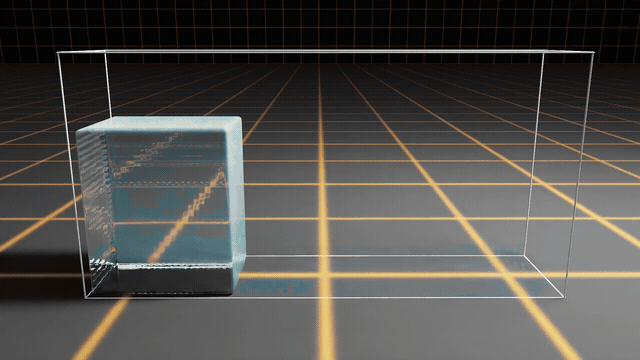

# Fluid Simulation

An experimental fluid simulation repository built on NVIDIA Warp, with Newton-integrated WCSPH, DFSPH, PBF, and APIC solvers. It includes particle simulations, interactive viewers, USD scene loading, and an APIC wave-tank demo with surface reconstruction.

**APIC and DFSPH are still being tuned and validated. They are not final implementations; solver parameters, stability controls, and numerical behavior may change.**

## Demos

### APIC Demo

[](resources/apic.mp4)

[Full APIC video (MP4)](resources/apic.mp4)

### WCSPH Demo


## Solvers

| Method | Implementation | Description |
| --- | --- | --- |
| WCSPH | `solver/sph/solver_wcsph.py` | Weakly compressible SPH, with pressure computed from a density-based equation of state. |
| DFSPH | `solver/sph/solver_dfsph.py` | SPH with iterative velocity corrections for density error and density change rate. |
| PBF | `solver/pbf/solver_pbf.py` | Position-based density constraints, artificial pressure, and XSPH velocity smoothing. |
| APIC | `solver/apic/solver_apic.py` | Particle–grid simulation on a sparse `warp.fem.Nanogrid`, with affine velocity transfer and optional pressure projection. |

The Newton solvers follow `SolverBase.step(state_in, state_out, control, contacts, dt)`. Particle positions and velocities use Newton state arrays; additional quantities such as SPH density, PBF multipliers, and APIC affine matrices are registered as custom attributes.

APIC transfers particle velocities to the grid, applies gravity and box boundary conditions, projects grid velocities toward a divergence-free field, and transfers velocities and gradients back to particles. Its current configuration also includes particle separation and affine/speed limits. Surface reconstruction is a visualization step, separate from the pressure solve. These implementations are intended for experiments and learning; the included smoke tests cover a small set of cases.

## Environment

The documented setup uses **Python 3.13.5, Newton 1.6.0, and Warp 1.17.0**. Newton/Warp were checked in an isolated installation on **2026-09-28**; the remaining package versions and hardware below come from the development machine. This is a reproducibility reference, rather than a claim that every simulation has been fully validated.

| Component | Version / configuration |
| --- | --- |
| OS | Ubuntu 24.04.1 LTS, x86_64 |
| Python | **3.13.5** |
| Newton (`newton`) | **1.6.0** |
| NVIDIA Warp (`warp-lang`) | **1.17.0** |
| NumPy | 2.4.3 |
| OpenUSD Python bindings (`usd-core`) | 26.8 |
| Pyglet | 2.1.16 |
| ImGui Bundle (`imgui-bundle`) | 1.92.801 |
| GPU | NVIDIA GeForce RTX 4090, 24 GB |
| NVIDIA driver | 580.173.02 |
| CUDA version reported by Warp | Toolkit 12.9; driver CUDA compatibility 13.0 |

CUDA values above describe the Warp runtime and driver, not a required local `nvcc` installation. The default demo device is `cuda:0`; interactive OpenGL viewers also require a working desktop/display environment. Small solver tests can use CPU.

### APIC demo compatibility

`newton_apic_test.py` requires `newton.geometry.ParticleSurface`, introduced in **Newton 1.6.0**. Newton 1.6.0 also requires **`warp-lang>=1.17.0`**; the pinned setup uses Warp 1.17.0. See the [Newton 1.6.0 release notes](https://github.com/newton-physics/newton/releases/tag/v1.6.0) and [ParticleSurface API](https://newton-physics.github.io/newton/1.6.0/api/_generated/newton.geometry.ParticleSurface.html).

All four Newton demo command-line entry points import successfully with Newton 1.6.0 and Warp 1.17.0. Older Newton builds such as 1.5.0 fail to import the APIC demo, even with `--no-surface` or `--no-viewer`, because `ParticleSurface` is imported at startup.

## Installation

For the dependency versions listed above, create a Python 3.13.5 environment and install the pinned packages:

```bash
git clone https://github.com/SParksLz/fluid_simulation.git
cd fluid_simulation

conda create -n fluid-simulation python=3.13.5 -y
conda activate fluid-simulation
python -m pip install -r requirements.txt
```

`requirements.txt` covers the solvers, APIC surface reconstruction, OpenGL viewers, and USD support. The optional RTX viewer additionally requires `ovrtx`; it is not installed or validated in the environment snapshot above.

To inspect the installed core versions:

```bash
python --version
python -c "from importlib.metadata import version; print('Newton:', version('newton')); print('Warp:', version('warp-lang'))"
```

## Running the examples

Run commands from the repository root. `--frames` controls the number of rendered frames; `--device` selects the Warp device.

### Newton WCSPH, DFSPH, and PBF

These examples load `temp/fluid_particles.usd` by default. That scene is included in the repository. A custom scene must contain a `UsdGeom.Points` prim at `/Fluid/Particles` with `points` and `widths` attributes.

```bash
python newton_tank_test.py --device cuda:0 --frames 600 --color-field pressure
python newton_dfsph_test.py --device cuda:0 --frames 600 --color-field kappa_v
python newton_pbf_test.py --device cuda:0 --frames 600 --color-field rho
```

Use `--usd path/to/scene.usd` to load another particle scene. The WCSPH and DFSPH examples scale input positions by 100 and convert them back for display; the PBF example uses input positions directly and configures its bounds from the scene. Account for this difference when sharing scenes or comparing parameters.

### APIC wave tank

APIC generates its water column procedurally and does not need an input USD scene. Use Newton 1.6.0 and Warp 1.17.0 as described above.

```bash
# OpenGL wave tank with surface reconstruction
python newton_apic_test.py --device cuda:0 --particles 100000 --frames 600

# Headless particle simulation without surface extraction
python newton_apic_test.py --device cuda:0 --particles 10000 --frames 30 --no-viewer --no-surface

# Record a USD clip
python newton_apic_test.py --device cuda:0 --particles 100000 --viewer usd --frames 120 --output-path apic_wave_tank.usdc
```

Useful options include `--show-grid`, `--show-particles`, `--no-projection`, `--voxel-size`, and `--surface-voxel-size`. The default target particle count is 400,000; actual counts depend on the generated lattice. The demo uses four simulation substeps per 1/60-second frame. Use `python newton_apic_test.py --help` for the full option list.

### Original Warp experiments

`tank_test.py` and `suction_test.py` are standalone experiments using `wcsph_kernel.py`, separate from the Newton solver wrappers. `tank_test.py` currently selects its DFSPH path in the main block. `suction_test.py` expects `temp/fluid_suction_scene.usd`, which is not included; it requires a scene with the dropper/container data used by its loader.

## Tests

Run the included APIC tests and the original DFSPH kernel tests without installing pytest:

```bash
python -m unit_test.unit_test_apic
python -m unittest discover -s unit_test -p 'unit_test_dfsph.py' -v
```

Both suites select CUDA when available. On Linux, force CPU for small smoke tests with:

```bash
CUDA_VISIBLE_DEVICES="" python -m unit_test.unit_test_apic
CUDA_VISIBLE_DEVICES="" python -m unittest discover -s unit_test -p 'unit_test_dfsph.py' -v
```

The APIC suite covers custom attributes, falling particles within a box, and a projection/thickness check. The DFSPH suite exercises the kernels in `wcsph_kernel.py`, rather than the Newton `SolverDFSPH` wrapper.

On 2026-09-28, the documented Python/Newton/Warp combination passed all three APIC CPU tests, both original DFSPH CPU tests, and the `--help` import checks for all four Newton demos. These checks do not establish accuracy or stability for full-size GPU simulations.

## Repository layout

```text
solver/
  apic/solver_apic.py       Sparse FEM APIC solver
  sph/solver_wcsph.py       Newton WCSPH solver
  sph/solver_dfsph.py       Newton DFSPH solver
  pbf/solver_pbf.py         Newton PBF solver
newton_*_test.py            Newton demo entry points
wcsph_kernel.py             Kernels for original SPH experiments
tank_test.py                Original tank experiment
suction_test.py             Original suction/dropper experiment
renderer/render_opengl.py   Custom Warp OpenGL renderer
unit_test/                 Small APIC and DFSPH tests
temp/                      Input USD scenes and local experiment outputs
resources/                 Demo videos and GIFs
docs/superpowers/          Historical APIC design and implementation notes
```

The APIC design notes describe the original skeleton before pressure projection was added; the current solver code is the source of truth for implemented features.
